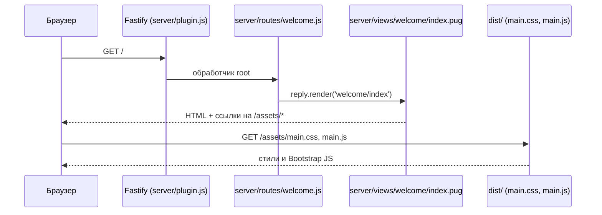
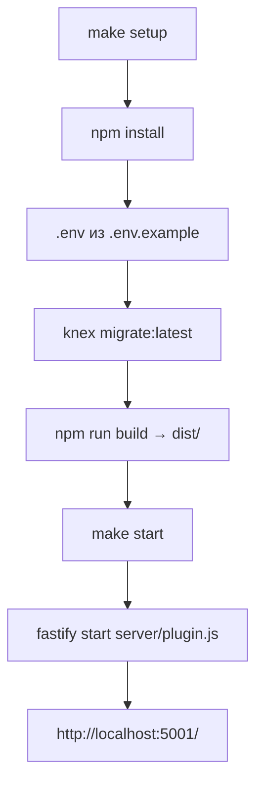
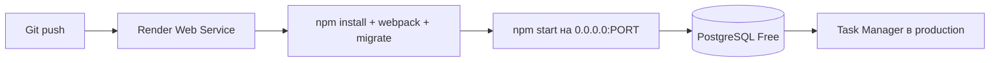

# Как устроен проект Task Manager

Документ описывает архитектуру приложения на базе [fastify-nodejs-application](https://github.com/hexlet-boilerplates/fastify-nodejs-application) и помогает быстро ориентироваться в коде.

## Обзор

Task Manager — серверное веб-приложение на **Fastify** с шаблонами **Pug**, стилями **Bootstrap** + кастомный CSS, ORM **Objection/Knex** и деплоем на **Render** (Web Service + PostgreSQL).

NPM-пакет: `@hexlet/code`  
Точка входа: `server/plugin.js` — экспортирует async-функцию, которую поднимает `fastify-cli`.

## Ключевые модули

| Модуль | Файл | Назначение |
|--------|------|------------|
| Точка входа | `server/plugin.js` | Регистрация плагинов, БД, i18n, статики, маршрутов |
| Маршруты | `server/routes/*.js` | HTTP-обработчики (welcome, users, session) |
| Шаблоны | `server/views/**/*.pug` | HTML-разметка страниц |
| Локализация | `server/locales/ru.js` | Тексты интерфейса (совпадают с демо Hexlet) |
| Модели | `server/models/*.cjs` | Objection-модели (User и базовая модель) |
| Миграции | `server/migrations/` | Схема БД через Knex |
| Конфиг БД | `knexfile.js` | SQLite (dev/test), PostgreSQL (production) |
| Фронтенд | `src/index.js`, `src/styles/app.css` | Сборка CSS/JS в `dist/` через Webpack |
| Method override | `server/lib/methodOverride.js` | POST + `_method` для logout (совместимость с Fastify 5) |
| Деплой | `render.yaml` | Blueprint для Render (web + PostgreSQL) |

## Конфигурация (12-factor)

Секреты и настройки хранятся в **переменных окружения**, не в репозитории:

- `SESSION_KEY` — ключ шифрования сессии
- `DATABASE_URL` — строка подключения PostgreSQL (на Render задаётся автоматически)
- `PORT` — порт сервера (Render задаёт сам; локально по умолчанию 5001)
- `NODE_ENV` — режим (`development` / `production` / `test`)

Локально значения загружаются из `.env` через [dotenv](https://www.npmjs.com/package/dotenv) (см. `.env.example`).

## Схема: запрос главной страницы



## Поток запуска локально



## Поток деплоя на Render



Render требует привязку к `0.0.0.0` (не `localhost`) — это настроено в `package.json` → `scripts.start`.

## Структура каталогов

```
.
├── server/
│   ├── plugin.js          # точка входа Fastify
│   ├── routes/            # маршруты
│   ├── views/             # Pug-шаблоны
│   ├── models/            # Objection-модели
│   ├── migrations/        # миграции Knex
│   ├── locales/           # i18n
│   └── helpers/           # хелперы для шаблонов
├── src/                   # исходники фронтенда (webpack)
├── dist/                  # собранные ассеты (не в git)
├── __tests__/             # Jest-тесты
├── knexfile.js
├── webpack.config.js
├── render.yaml
└── package.json           # name: @hexlet/code, main: server/plugin.js
```

## Что проверять после изменений

1. `make setup && make start` — главная отдаёт 200 и текст «Привет от Хекслета!»
2. `make test` — проходят тесты из `__tests__/`
3. `curl -I http://localhost:5001/` — статус 200
4. После деплоя — health check `/` на Render и работа PostgreSQL (миграции в build)

## Полезные ссылки

- [Демо Hexlet](https://js-task-manager-ru.hexlet.app/)
- [The Twelve-Factor App (ru)](https://12factor.net/ru/)
- [Render: PostgreSQL](https://render.com/docs/postgresql-creating-connecting)
- [Deploy Node Fastify on Render](https://render.com/docs/deploy-node-fastify-app)
